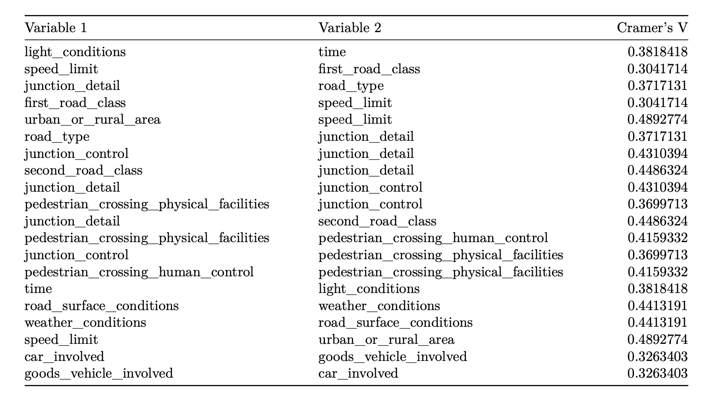

# Investigation of the effect of speed limit on the severity of road traffic accidents in the UK 2020 

Road traffic accidents (RTAs) are a significant and ongoing problem in the United Kingdom. In 2020, 91,199 reported road accidents resulted in 19,746 serious or fatal injuries and 71,453 slight injuries, devastating consequences for those involved, their families, and society.

It continues to cause severe injuries and incur high costs despite government efforts to avoid them. This analysis investigates the relationship between accident severity and speed limit using data from the UK’s Department for Transport on RTAs in 2020 while also considering other variables that may affect this relationship.

It aims to investigate the relationship between accident severity and the speed limit at the accident location, using the data collected by the UK’s Department for Transport (DfT) on RTAs during 2020. While the main objective is to understand the relationship between accident severity and speed limit, other variables present in the data may confound the relationship between these two and will have to be taken into consideration when investigating the relationship between accident severity and the speed limit.

This project was a team effort. Only provide dataset downloads but do not offer code references. All data work was done in R. Special thanks to my team members:  Fernando Rodriguez Santamaria, Hanxi Ji, and Jiajin Jin.

## Content
- [1. Data](#1)
    - [1.1 Data Introduction](#1-1)
    - [1.2 Data Cleaning](#1-2)
- [2. Exploratory Data Analysis](#2)
- [3. Variables Selection](#3)
- [4. GLM](#4)
- [5. Conclusions](#5)

## 1. Data
### 1.1 Data Introduction
The data utilized in this analysis consists of [three different datasets](https://github.com/atomxu10/GLMProject/tree/main/data) published by the DfT, namely Accidents, Vehicles, and Casualties, each providing a detailed account of different aspects of road accidents. The datasets provide a comprehensive and detailed understanding of the factors contributing to road accidents, including the characteristics of vehicles, drivers, casualties, driving conditions, and road features.

The Accidents dataset provides information on accident severity, speed limit, location, driving conditions, and casualties involved in each incident. It includes 36 variables, covering many details, such as light conditions, weather conditions, hazards, and police attendance.

The Vehicles dataset covers 27 variables that provide a detailed account of the vehicles and drivers involved in each accident. It includes information on the type of vehicle, manoeuvre performed during the accident, driver age and sex, the vehicle makes and model, fueling system, and engine capacity. The dataset has multiple rows of data per accident reference number, each representing a different vehicle involved in the accident.

The Casualties dataset includes 18 variables that convey information on the casualties involved in each accident. It contains details on the age and sex of each casualty, whether they were a pedestrian or in a vehicle. Their movement and location during the accident are also included if they were pedestrians. The dataset has multiple rows of data per accident reference number, each representing a different casualty involved in the accident.

### 1.2 Data Cleaning
For this analysis, the accident severity in the Accidents dataset was recorded as “fatal or serious” and “slight,” which differs from the original data, which recorded each severity separately as “fatal,” “serious,” and “slight.” Initial data cleaning consisted of converting -1 values into NAs as these values were known to be missing, given the information available from the data dictionary included with the three datasets of interest. Most of the data variables consisted of categorical values, indicating that they were composed of distinct groups. For example, the accident severity variable is a categorical variable in which each accident is either considered “fatal or serious” or “slight.” Many numerical variables detailed the number of vehicles and casualties involved in each accident, the ages of drivers, casualties, and vehicles in addition to their engine capacity.

The Vehicles and Casualties datasets comprised multiple rows per accident. Given the hierarchical nature of this data, statistical analysis would require using random effects models to account for the correlation of the data. Given this, the data in the two datasets was summarised into one row per accident reference number such that traditional methods of generalized linear models (GLMs) would be applicable. Not accounting for this and still using standard GLMs would have violated the assumptions of independence in the data, as each accident would be recorded in the data multiple times to account for the multiple vehicles and casualties involved in each accident. In order to summarise these data into a single row per accident reference, the following approach was used:

- Group the data by the accident reference number
- If the variable is numeric, summarise the mean, minimum and maximum values
- If the variable is categorical, summarise whether any row in the group had a specific level of interest

To illustrate, when a categorical variable describing the types of vehicles engaged in an accident was examined, a new variable was created to indicate whether a motorcycle was involved. If a row in the category contained information related to a motorcycle, the new variable was assigned a value of “Y” to indicate involvement or “N” to indicate the non-involvement of a motorcycle. This process was repeated for every category level to retain as much data as possible for the relevant categorical variables.

Once each dataset had been reduced to one row per accident, they were joined to the Accidents dataset by using the accident reference number to match the observations to the correct accident, resulting in a single data set containing all the information available from the three datasets. Finally, variables containing high levels of missing data, above 5%, were removed from further analysis as these often had other variables in the data set that reported similar information.

## 2. Exploratory Data Analysis
A total of 91,199 road traffic accidents were recorded in 2020. Among them, 21.7% were defined as ‘Fatal or serious,’ and 78.3% were defined as ‘Slight.’ More accidents occurred in the summer (23,753), autumn (25,733), and winter (26,265), and relatively few in the spring (15,448). However, the proportion of fatal or serious accidents in spring was higher than in other seasons, at 23.3%. During the day, accidents were mainly concentrated in the afternoon (12-18) and the morning (6-12), with 43.8% and 26.0%, respectively, while the evening hours (0-6) had the highest risk of a severe accident at 26.0%. 68% of accidents occurred in urban areas (versus 32% in rural areas). The majority of accidents occurred at roundabouts (73.4%).
Most accidents occurred on roads with a speed limit of 30mph (57.3%). The following highest percentage of accidents occurred on roads with speed limits of 60mph (12.5%) and 20mph (12.3%), followed by 40mph (8.6%), 70mph (5.1%), and 50mph (4.2%) (refer to Figure 1[left]). The severity of accidents also varied depending on the speed limit on the road. Roads with higher speed limits had a higher proportion of serious accidents, with those with a speed limit of 60mph having the highest percentage of severe accidents (32.7%). The severity of accidents decreased for roads with speed limits of 50mph (24.8%) and 70mph (24.6%), followed by 40mph (23%), 30mph (19.7%), and 20mph (15.7%) (refer to Figure 1[right]).

    

Figure 1: The number of accidents per speed limit - the number of accidents occurred on roads with different mph speed limits. (Left) the proportion of accidents categorized as ‘Fatal or serious’ according to the different speed limits 

Table 1 shows the severity of accidents corresponding to lighting conditions, with 71% of all accidents occurring in daylight conditions, 21% of which were serious. Accidents in darkness with lights lit accounted for 21% of the overall accidents, of which 22% were fatal or serious. The overall percentage of accidents in darkness with no lights lit made up only 1% of the total accidents in the data. However, 25% of these accidents were considered fatal or serious. The percentage of accidents that occurred in darkness with no lighting was 5%, of which 33% were classified as fatal or serious. Finally, the percentage of accidents that occurred in darkness, where lighting conditions were unknown, made up 2% of the total accidents, of which 14% were considered fatal or serious. The data suggest that light conditions may contribute to the severity of accidents.

    

 Table 1: Distribution of light conditions involved 

The data presented in Figure 2 displays the proportion of fatal or serious accidents on roads with different speed limits under varying light conditions, namely daylight and darkness. The findings reveal that, for vehicles travelling at the same speed limit, the severity of accidents is generally higher in darkness than in daylight. At a speed limit of 40mph, the disparity in accident severity between the two light conditions is most pronounced, with a difference of 28% in darkness (versus 22% in daylight). As the speed limit increases, the proportion of fatal or serious accidents occurring in darkness compared to daylight conditions becomes more significant.

    

 Figure 2: Proportion of fatal and serious accidents in different light situations by speed limits 

## 3. GLM
### 3.1 Variables Selection
Following on from the EDA, variables that had been identified to have an impact on accident severity were considered for inclusion in statistical models. Several variables within and across each dataset measured similar information, so these variables were highly associated. Including variables with high levels of association can cause multicollinearity in statistical models, which may distort or confound the effects of variables on accident severity, resulting in unstable or unreliable estimates of the regression coefficients.

In this analysis, Cramer’s V was used to identify which variables were most strongly related to each other. Cramer’s V Test is a type of statistical measure that is based on Pearson’s chi-squared statistic. Cramer’s V is specifically used to measure the strength of the relationship between two categorical variables. Cramer’s V results range from 0 to 1, with 0 indicating no association between the two variables and 1 indicating an opposite conclusion (Highly associated).

As shown in Table 2, A Cramer’s V value greater than or equal to 0.3 between two variables was considered sufficient to classify them as highly associated and to justify removing one from model inclusion.

    

 Table 2: Variables with high levels of association 

### 3.2 Model Method
Logistic regression was used to model the accident severity and the impact of the speed limit on it while adjusting for the identified variables after removing highly associated categorical variables. Additional interaction terms were added to the model. The final regression model was selected by comparing models using Likelihood Ratio Tests (LRTs) and model fit statistics such as AIC, BIC, and Pseudo-R squared to determine the best-fitting model.

- **Akaike Information Criterion (AIC)** is a statistical measure used to estimate the quality of a statistical model based on the Kullback-Leibler information. It can compare the fitting degree between the fitted and generated or actual models, which is helpful when selecting statistical models. AIC is equal to 2 times the difference between the number of parameters of the model and the maximized log-likelihood. The model with a lower AIC value will be chosen, and the chosen model will include more information than other models. AIC can help to avoid the risk of overfitting and underfitting

- **Bayesian Information Criterion (BIC)** is a statistical method of model selection based on Bayesian inference. BIC can compare the goodness of fit of a model and is helpful when weighing the complexity and fitting goodness of models. When choosing the optimal model, the model with a lower BIC value will be applied, showing that it fits better with the data. BIC computes a heavier penalty on models’ complexity than AIC, making it suitable for models with small sample sizes.

- **Pseudo R-squared** is a statistical metric that evaluates the fitness of a regression model by contrasting it with a null model that contains only the intercept. The computation involves taking the ratio of the reduction in the residual sum of squares of the full model compared to the null model. There are several types of pseudo R-squared, each with its unique equation and meaning. Although pseudo R-squared does not have a direct interpretation of the percentage of variability clarified in the dependent variable, it provides a comparative measure of the model’s enhancement over the null model. The interpretation of pseudo R-squared is similar to that of the conventional R-squared, with greater values indicating a better fit of the model.

- **The likelihood ratio test (Wilks test)** is a classical statistical hypothesis test used to select the best-fitting model from two nested models, where one is more complex than the other. The test determines if the simpler model is adequate by calculating the ratio of likelihoods of the two models. The test statistic is measured by two times the difference between the log-likelihoods of the two models, which follows a chi-square distribution with p degrees of freedom (p being the difference in the number of parameters in the two models). When the test statistic exceeds the critical value, the more intricate model is preferred. In contrast, if the test statistic is lower than the critical value, the simpler model is favored. The likelihood ratio test helps to determine if the simple model is inadequate when fitting the data.

### 3.3 Model Selection
As shown below in Table 3, LRTs comparing the more complex model to its simpler version always came out with a p-value <0.001, meaning that the more complex model fits the data better. Nonetheless, the likelihood ratio test (LRT) between model 2 and its simpler version, model 3, which excludes highly correlated variables, produced a statistically significant p-value, suggesting that model 2 is superior. However, this needs to account for the potential multicollinearity problems Model 2 has due to the high associated variables in
that model. Thus, model 3 and model 4 were preferred as it has the lowest AIC, BIC, and highest pseudo-R squared.

    

 Table 3: Model comparison for variable selection 

### 3.4 Model Result

